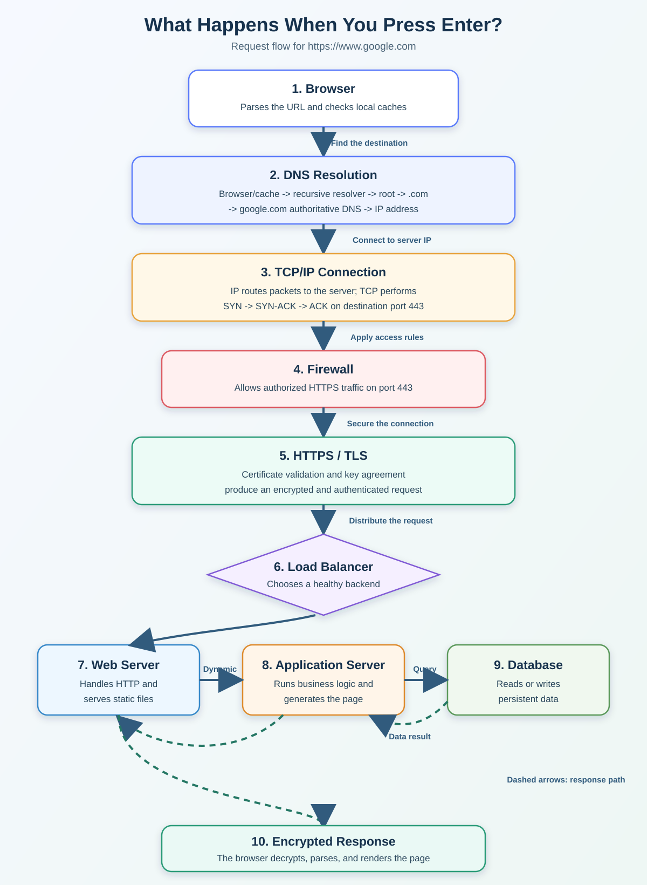
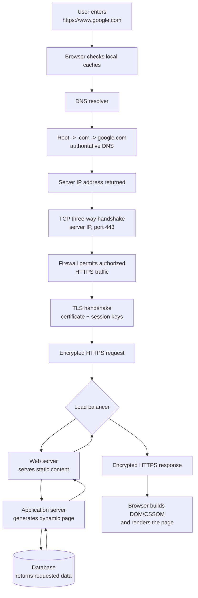

# Everything's Better with a Pretty Diagram

**Diagram image URL:** [Open the request-flow diagram](https://raw.githubusercontent.com/JGonzalez-7/holbertonschool-network/main/what_happens_when_your_type_google_com_in_your_browser_and_press_enter/request_flow.svg)

## Answer



The diagram is also available as editable Mermaid source:



## Explanation

- **DNS resolution:** The browser obtains an IP address for `www.google.com` by checking caches and, when necessary, querying a recursive resolver that follows the root, `.com`, and authoritative DNS hierarchy.
- **Server IP and port:** The browser connects to the returned server IP. In the classic HTTP/1.1 or HTTP/2 path, TCP establishes the connection on HTTPS port `443`.
- **Encrypted traffic:** A TLS handshake authenticates the server certificate and creates session keys. The HTTP request and response are then encrypted.
- **Firewall:** Security rules allow authorized HTTPS traffic while blocking connections to services that should not be public.
- **Load balancer:** The load balancer selects a healthy backend so that traffic is distributed instead of overwhelming one server.
- **Web server:** The web server handles HTTP and can return static files such as HTML, CSS, JavaScript, and images.
- **Application server:** Dynamic requests are passed to application code, which validates input, runs business logic, and generates the page or response.
- **Database:** The application server requests persistent information from a database. The result returns to the application and is included in the generated response.
- **Browser rendering:** The response travels back through the infrastructure over the encrypted connection. The browser parses the resources and displays the page.

The diagram uses separate boxes to show logical responsibilities. In a production system, some responsibilities may share a machine, and a large service may use many additional proxies, caches, and internal services.

## Expected Output

Opening this Markdown file on GitHub displays a diagram with the following complete flow:

```text
Browser -> DNS -> server IP:443 -> firewall -> TLS encryption
        -> load balancer -> web server -> application server
        -> database -> encrypted response -> rendered page
```

The direct diagram URL works after `request_flow.svg` has been committed and pushed to the repository's `main` branch.

## Git Commit Message

```bash
git add what_happens_when_your_type_google_com_in_your_browser_and_press_enter/1-what_happen_when_diagram.md \
  what_happens_when_your_type_google_com_in_your_browser_and_press_enter/request_flow.svg
git commit -m "added Task 1: \"Everything's better with a pretty diagram\""
```
